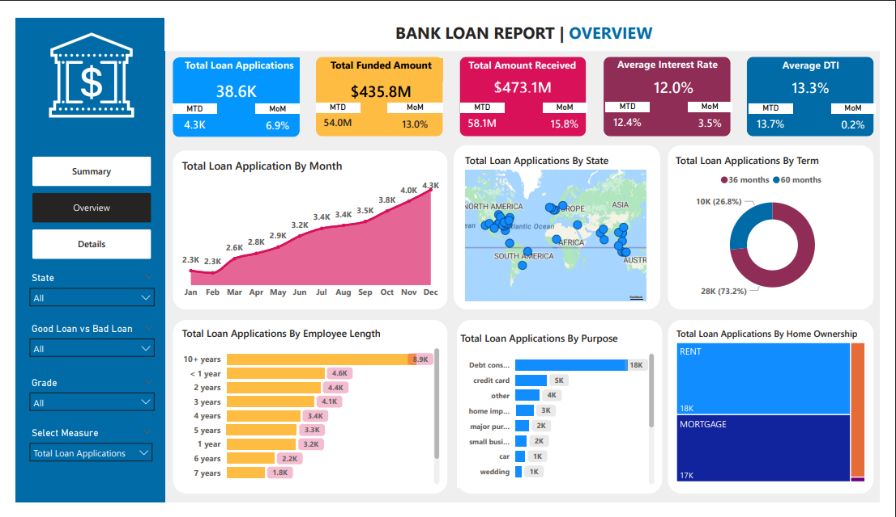
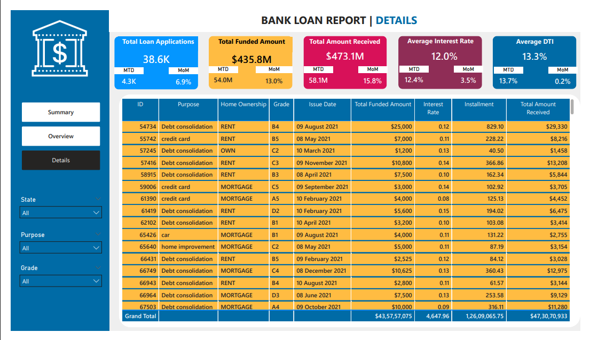

# 🏦 Bank Loan Analysis (SQL + Power BI)

An end-to-end **Bank Loan Portfolio Analysis** project where I used **MS SQL Server** for querying + validation and **Power BI** to build a clean, interactive dashboard with **3 pages**: **Summary, Overview, and Details**.

This report helps answer practical banking questions like:
- Are loan applications increasing month over month?
- How much has been **funded** vs **received**?
- What portion of loans are healthy (**Fully Paid / Current**) vs risky (**Charged Off**)?
- Which **states, purposes, terms, and borrower profiles** drive most applications?
- Are **Interest Rate** and **DTI (Debt-to-Income)** staying under control?

## 📌 Project Background (Why this matters)

Banks handle thousands of loans, but raw data alone doesn’t help. The real need is a dashboard that clearly shows:
- portfolio performance,
- portfolio health (good vs bad),
- risk signals,
- trends and segmentation,
- and drill-down views for investigation.

This analysis supports smarter lending decisions, better portfolio monitoring, and early risk detection.

## 🎯 Objective (What I owned)

I built this project as if I’m supporting a bank’s lending team and leadership with:

- A **high-level KPI dashboard** for loan portfolio health  
- A **trend + segmentation dashboard** to explore drivers behind performance  
- A **detail-level dashboard** for operational drill-down (one-stop view)

The focus was: **clarity, accuracy, and decision usefulness**.

## ✅ What I did (Process + Approach)

### 1) Understand the business meaning of the data
Before creating visuals, I mapped important banking fields and what they mean in real-world terms:

- **Loan Status**: Fully Paid, Current, Charged Off  
- **DTI (Debt-to-Income)**: borrower debt load level  
- **Term**: 36 vs 60 months  
- **Grade / Sub-Grade**: risk classification  
- **Purpose**: debt consolidation, credit card, home improvement, etc.  
- **Home Ownership, Employment Length, Annual Income, Interest Rate**, and more  

This step matters because dashboard numbers are only useful if the definitions are correct.

### 2) Work in SQL Server (validation layer)
I used **MS SQL Server / SSMS** to:
- load and review data
- write queries to compute KPIs and segmented metrics
- cross-check logic before building visuals

This is important because dashboards must be **trustworthy**—numbers should match the source logic.

### 3) Build the Power BI dashboard (model + visuals)
In Power BI, I:
- connected Power BI to SQL Server
- cleaned and shaped data (Power Query)
- created KPI measures (DAX)
- designed a **3-page report** with slicers + navigation
- focused on readability (KPI cards, drilldowns, consistent formatting)

## 🧰 Tools Used

- **MS SQL Server + SSMS** (data storage, querying, validation)
- **Power BI Desktop** (data modeling, DAX measures, dashboarding)
- **Excel** (supporting checks / quick review)

## 📊 KPI Metrics Built (What the dashboard tracks)

### Core KPIs (portfolio performance)
- **Total Loan Applications**
- **Total Funded Amount**
- **Total Amount Received**
- **Average Interest Rate**
- **Average DTI**
- **MTD (Month-to-Date)** tracking
- **MoM (Month-over-Month)** changes for key KPIs

### Portfolio Quality (Good vs Bad Loans)
To quickly understand portfolio health:
- **Good Loan % / Applications / Funded Amount / Received Amount**
- **Bad Loan % / Applications / Funded Amount / Received Amount**

## 🧾 Key Results (From the dashboard)

### Portfolio totals
- **Total Loan Applications:** **38.6K**
- **Total Funded Amount:** **$435.8M**
- **Total Amount Received:** **$473.1M**
- **Average Interest Rate:** **12.0%**
- **Average DTI:** **13.3%**

### Month-to-Date tracking (MTD)
- **MTD Applications:** **4.3K**
- **MTD Funded Amount:** **$54.0M**
- **MTD Amount Received:** **$58.1M**
- Interest rate and DTI are also tracked for MTD monitoring

### Portfolio quality split (Good vs Bad)
- **Good Loans:** **86.2%** (**33.2K applications**)  
  - **Good Funded Amount:** **$370.225M**  
  - **Good Received Amount:** **$435.8M**  

- **Bad Loans:** **13.8%** (**5.3K applications**)  
  - **Bad Funded Amount:** **$65.5M**  
  - **Bad Received Amount:** **$37.3M**

### Loan Status breakdown
The report categorizes outcomes by:
- **Fully Paid**
- **Current**
- **Charged Off**

…and compares funded/received amounts + averages by each status.

### ✅ Page 1 — Summary (Executive KPI View)
**What this page answers:**
- How big is the portfolio?
- Are we growing MoM?
- What is the portfolio health (good vs bad)?
- What is the loan status distribution?
  

### ✅ Page 2 — Overview (Trends + Segmentation)
**What this page answers:**
- Monthly trend of applications (seasonality)
- Which states drive the most applications (map)
- Term distribution (36 vs 60 months)
- Which segments dominate (purpose, employment length, home ownership)

### ✅ Page 3 — Details (Drill-down / One-stop view)
**What this page answers:**
- A consolidated detail-level view for investigation
- Quick filtering by State, Purpose, Grade to explore portfolio slices

 

 
## 🔍 How to Use the Report (Interactivity)

**Filters used in the dashboard:**
- State
- Purpose
- Grade

**Recommended workflow:**
- Start on **Summary** to check health + MoM movement
- Go to **Overview** to understand why results look that way (drivers)
- Use **Details** to validate and investigate specific segments

## 💡 What this dashboard enables (Business value)

This report helps teams to:
- Track lending growth using **MTD/MoM**
- Monitor risk using **Good vs Bad Loans** + **Loan Status**
- Identify high-demand regions and borrower segments (state, purpose, term, profile)
- Improve decision-making using **Interest Rate** + **DTI** monitoring

## 🧠 Skills Demonstrated

- Turning a business problem into measurable KPIs
- SQL querying for validation and metric building
- Power Query cleaning + structured modeling
- DAX measures for KPIs + time intelligence (MTD/MoM)
- Building a 3-page dashboard for both executives and analysts

